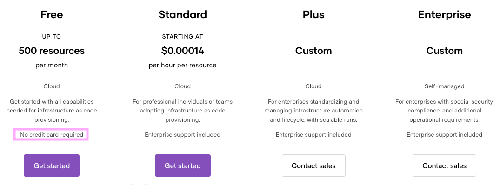
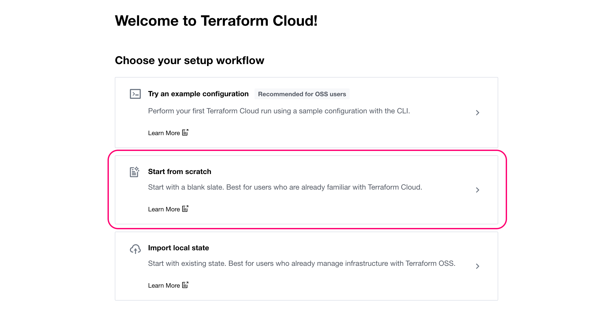
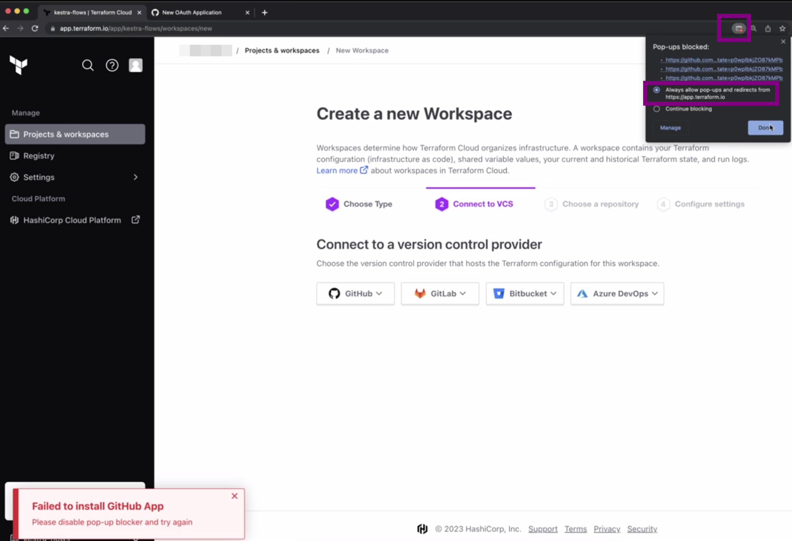
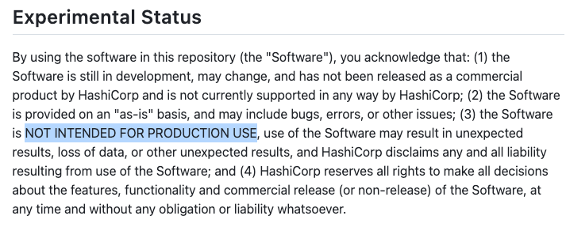

# What is Terraform Cloud

[Terraform Cloud](https://cloud.hashicorp.com/products/terraform) centrally manages Terraform runs and Terraform state files in a consistent and reliable environment (_rather than on a single local machine_). It securely **stores state and secret data**, and can connect to version control systems to implement **CI/CD** best practices.

Terraform Cloud offers many additional features including:

- a private registry for custom modules and providers
- access controls for approving changes
- cost estimates for the provisioned infrastructure
- detailed policy controls to ensure compliance of your Terraform configurations

**The most important features are:**

- making your infrastructure setup collaborative, observable and reliable
- with any new change, someone from your team can review and approve the plan before you apply those changes
- Terraform Cloud also locks the state during operations to prevent concurrent modifications that may corrupt the state file.

# Terraform Cloud Demo

## Prerequisites

To start using Terraform Cloud, you first have to sign up for an account [here](https://app.terraform.io/signup/account). 

You can use Terraform Cloud for free in order to manage up to 500 resources. You can reproduce everything we're gonna cover in this demo free of charge. 

It's worth highlighting that the "Free" plan is NOT a trial. It's a normal account you can use for production use cases. You only need to upgrade to standard or enterprise plans once you cross the 500 resources threshold or when you need enterprise support. 

Here is [pricing](https://www.hashicorp.com/products/terraform/pricing) overview as of end of May 2023:

## Agenda for the demo

Once you have an account, we will walk through the following steps:

1. Creating an **organization** 
2. Connecting your **VCS Provider** (recommended) 
3. Creating a **workspace**. 
4. Connecting your workspace with the **repository** containing your Kestra flows and Terraform code.

Specifically, we will:

1. Create an organization named `data-team`
2. Authorize **GitHub** as our VCS Provider
3. Create a workspace named `kestra-prod` and assign it to a **project** named `Orchestration`.
4. Create **Kestra resources** from a Terraform Cloud CI/CD.

# Demo

## Create an account (if you don't have one yet)

Visit https://app.terraform.io/signup/account and create a free Terraform Cloud account.

When you sign up, you will receive an email asking you to confirm your email address. Confirm your email address before moving on. When you click the link to confirm your email address, the Terraform Cloud UI will ask which setup workflow you would like use. Select **Start from scratch**.

## Create an organization
Let's login to Terraform Cloud and create an organization. Let's name the organization `data-team`, and I'll enter my email address to receive alerts and notifications.

## Add a VCS Provider
Now that we have created an organization, let's go to Organization Settings, Providers, Version Control System Providers and connect to GitHub. I will authorize Terraform Cloud to access my GitHub account. Select my GitHub organization, all repositories, and click on Install to install the GitHub App. 

Given that I have a multi-factor authentication enabled on my GitHub account, I need to enter a verification code on my phone.

### Troubleshooting tip
If you see a message: "Failed to install GitHub App", you need to allow pop-ups from Terraform Cloud in your browser window. 

## Create a workspace
The next step is to create a workspace. 

Terraform Cloud organizes resources by workspaces that contain:
1. Resource definitions
2. Variables
3. State files

Terraform compares the desired state declared in your Terraform code with the current state, stored in your state file.

I will name my workspace `kestra-prod`. And here we can choose the **workflow** type. 

1. **Version control workflow** - you store your Terraform configuration in a Git repository, and changes merged to the respective Git branch (_usually performed via Pull Requests_) automatically trigger `terraform plan & apply` runs.
2. **CLI-driven workflow** - you run `terraform plan` and `terraform apply` manually from your local machine or CI/CD system, and those commands run against Terraform Cloud's ephemeral remote execution backend.
3. **API-driven workflow** - you trigger `terraform apply` runs via the Terraform Cloud API, usually required when you want to manage Terraform resources via internal or legacy infrastructure management systems. This is also required if you want to trigger Terraform Cloud runs from GitHub Actions.

It's worth noting that there is an alternative option with a GitHub Action that you could implement yourself using the hashicorp/setup-terraform GitHub Action. However, this way you would need to maintain that workflow yourself. That's why I'd personally recommended leveraging the VCS workflow available by default, because this workflow is based on a GitHub app, managed and officially maintained by Terraform Cloud. In contrast, the GitHub Action has an experimental status. 

I will choose the most common `Version control workflow`.

We've already connected to a version control provider. I will choose GitHub and select the repository that contains Kestra flows and Terraform code.

In the project selection, I will create a new project named `Orchestration`. This way, within our **data team** organization we can have multiple projects, and each of those projects can contain several workspaces. For instance, the project `Orchestration` can contain workspaces `kestra-prod`, `kestra-staging`, etc.

---

# Kestra specific setup

We will now move to the Kestra setup. 

## Create a role and a user in Kestra UI
Given that our repository contains **variables** for username and password that represents Authentication to our Kestra instance, we need to first create a programmatic user that will have the least privileges to deploy Kestra resources.

Let's go to our Kestra instance and create a new role and user. I will name both the role and user as `terraform`.

First, let's create a role and assign it the following permissions.

Now let's create a user and assign it the role we've just created. 

## Terraform Variables

Now we need to add those credentials as Variables in the Terraform Cloud Workspace. Let's go to the Workspace Overview - Variables, and let's add the following variables:

1. `username` - the username of the user we've just created
2. `password` - the password of the user we've just created

**Optional description for the username:** 
Programmatic access user to deploy Kestra resources.

**Optional description for the password:**
Password for the programmatic access user.

## Terraform Runs
Now that we have created a workspace and added the variables, we can trigger the first Terraform run. 

This run will be manual at first. Then, we'll add new flows to the GitHub repository, and Terraform runs will start automatically via Teraform Cloud CI/CD. 

### Manual run

Go to Actions - Start new run - Start run. 

We can verify that the flows were correctly identified. Let's confirm plan and apply.

And we can now verify that the flows have been successfully deployed to Kestra 🎉
